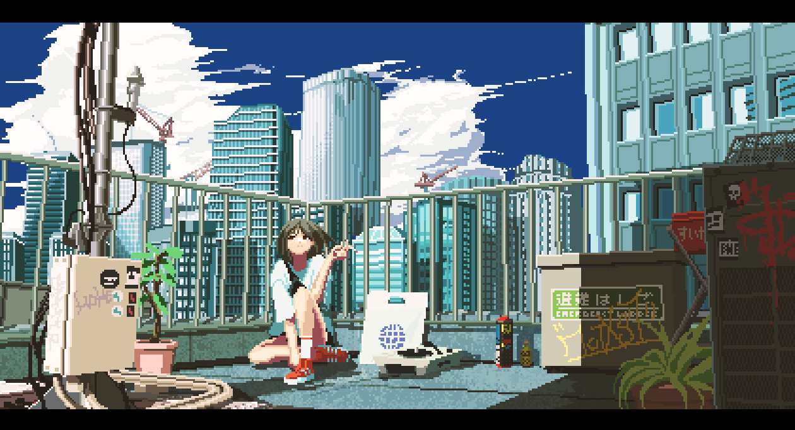
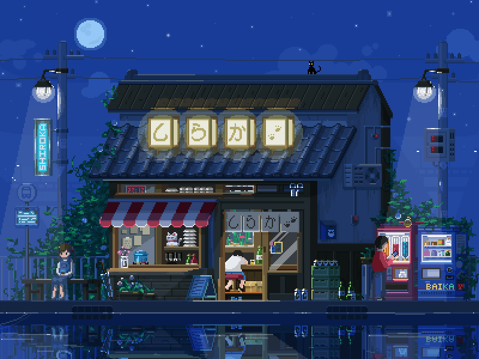

<div align="center">
  
</div>

<div align="center">
  <h1>ロッベン・サントサ | Robben Santosa</h1>
  <h3>静かにコードを書き、ゆっくり成長し、夜のピクセルに夢を見る。</h3>
  <sub>I write code quietly, grow steadily, and dream in midnight pixels.</sub>
  <br/>
  <sub>コーディングする空気感を大切にしながら、一歩ずつ前へ。</sub>
  <br/>
  <sub>Carrying a true codinger vibe, I keep moving forward one step at a time.</sub>
  <br/>
  <br/>
  

<br/>


</div>

---

<div align="center">
  
</div>

---

## [ 自己紹介 | About Me ]

<table>
  <tr>
    <td width="60%" valign="top">

- Web Development への興味から、この学びの旅が始まりました
- I am growing my skills in **HTML, CSS, and JavaScript**, and slowly expanding into **React, Node.js, and Python**
- **落ち着いたUI**、やさしい雰囲気のデザイン、そして読みやすいコードが好きです
- I enjoy dark interfaces, Japanese-inspired atmosphere, pixel details, and meaningful projects
- Quiet by nature, but full of **codinger energy** when building and learning
- **Git、GitHub、Web Development、beginner Python** の話なら気軽にどうぞ
- My long-term goal is to become a thoughtful **Software Engineer**

    </td>
    <td width="40%" align="center" valign="middle">
      
    </td>
  </tr>
</table>

---

## [ デジタルID | Digital Identity ]

<div align="center">
  <a href="https://instagram.com/kevincn45">
    
  </a>
  <a href="https://github.com/Robben-Santosa">
    
  </a>
  <a href="#">
    
  </a>
  <a href="mailto:your-email@example.com">
    
  </a>

  <br/>
  <sub>デジタルの夜で、ゆるくつながりましょう。</sub>
  <br/>
  <sub>Find me somewhere in the digital night.</sub>

</div>

---

## [ スキルセット | Loadout ]

<div align="center">
  

</div>

---

## [ 現在のスタック | Current Build ]

<div align="center">
  
  <br/>
  <sub><strong>Frontend</strong> • HTML • CSS • JavaScript</sub>

  <br/>
  <br/>

  
  <br/>
  <sub><strong>学習中</strong> • React • Node.js</sub>

  <br/>
  <br/>

  
  <br/>
  <sub><strong>Core Tools</strong> • Python • Git • GitHub • VS Code</sub>

  <br/>
  <br/>

  <sub><strong>Aesthetic</strong> • Japanese Dark • Pixel • Calm UI</sub>

</div>

---

## [ GitHub Stats ]

<div align="center">
  
  
</div>

<div align="center">
  
</div>

---

## [ シグナル | Signal Board ]

<div align="center">
  <table>
    <tr>
      <td align="center" width="50%">
        
        <br/>
        <sub>Web development を学びながら、基礎をしっかり磨いています。</sub>
      </td>
      <td align="center" width="50%">
        
        <br/>
        <sub>静かな心で進みながら、learn deeply and keep going.</sub>
      </td>
    </tr>
  </table>
</div>

---

## [ ピンしたプロジェクト | Pinned Projects ]

<div align="center">
  <a href="https://github.com/Robben-Santosa/nama-repo-1">
    
  </a>
  <a href="https://github.com/Robben-Santosa/nama-repo-2">
    
  </a>
</div>

<div align="center">
  <sub><code>nama-repo-1</code> と <code>nama-repo-2</code> を実際のリポジトリ名に置き換えてください。</sub>
  <br/>
  <sub>Replace <code>nama-repo-1</code> and <code>nama-repo-2</code> with your real repositories.</sub>
</div>

---

## [ 活動グラフ | Contribution Graph ]

<div align="center">
  
</div>

---

## [ Now Playing | 再生中 ]

<div align="center">
  <a href="https://spotify-github-profile.kittinanx.com/api/view?uid=31embqeq76gci67amhtwsbfhqlde&redirect=true">
    
  </a>
</div>

---

## [ 最後のメッセージ | Final Transmission ]

<div align="center">

```text
静かな夜の思考
pixel heart
midnight coding
keep moving forward
```

<sub>Made in Bandung with 静かな ambition, dark palettes, and late-night curiosity.</sub>

</div>
